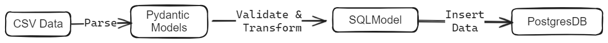
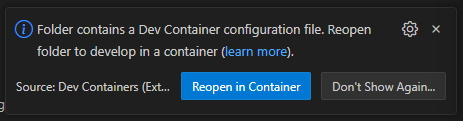

# Deposit rate sensitivity to central bank policy taget adjustments

Analysis of deposit rate pass through effects from tightening monetary conditions. How the sensitivity to adjustments in central bank policy targets varies across hiking cycles.

## Description

Central Banks around the world implement monetary policy in a variety of different ways, but one key transmission mechanism is typically a short-term rate at which commercial banks can borrow from the central bank. This rate, the ‘policy rate’, effectively becomes a floor on other rates, and measuring the sensitivity of other rates, such as the deposit rate, to changes in the policy rate, can give an indication as to how quickly monetary policy is transmitted in each cycle. For this project, the objective is to evaluate the sensitivity of deposit rates on consumer savings accounts to changes in the central banks’ policy rate across different economic cycles. The methodology can be expanded to evaluate multiple countries cross sectionally, or to evaluate a single country over several cycles.

The methodology applied in this project is designed to be replicable across different countries and time periods, which allows for its usage in scenarios where central banks provide explicit targets, target ranges, or operate without a clearly defined target. The project can be employed to analyze and compare the sensitivity of deposit rates on consumer savings accounts to changes in central banks’ policy rates across different economic and temporal contexts. This cross-country and cross-temporal applicability assures the project's utility in capturing variations in monetary policy transmission mechanisms globally.

## Data

This project is set up to use monthly policy rates and deposit rates for a particular country. For those looking to replicate this analysis on a different country, if a country doesn't have a specific target, it may be extrapolated from a target range. In the example case, we use the midpoint of a range from the Swiss National Bank from 2000-2019, and then a target from 2019 onwards (they introduced a target at that time).

Project Organization
------------

    ├── LICENSE
    ├── README.md          <- The top-level README for developers using this project.
    ├── assets             <- Images used in the README.md file
    |
    ├── .devcontainer               <- Folder for the devcontainer configuration files and Dockerfile & Docker Compose files
    │   ├── Dockerfile              <- Dockerfile for the devcontainer
    │   ├── devcontainer.json       <- Devcontainer configuration file
    │   └── docker-compose.yml      <- Docker Compose file for the devcontainer
    │
    ├── data
    │   ├── external       <- Data from third party sources.
    │   ├── interim        <- Intermediate data that has been transformed.
    │   ├── processed      <- The final, canonical data sets for modeling.
    │   └── raw            <- The original, immutable data dump.
    │
    ├── notebooks          <- Jupyter notebooks. 
    │
    ├── reports            <- Generated analysis as HTML, PDF, LaTeX, etc.
    │   └── figures        <- Generated graphics and figures to be used in reporting.
    |   └── template.tex   <- To compile the LaTeX document into a PDF report, ensure that the PDFs generated in "figures" are placed in the same directory as main .tex file. 
    │
    ├── app                <- Source code for use in this project.
    │   ├── __init__.py    <- Makes app a Python module
    |   ├── main.py        <- Main application file for FastAPI application
    │   ├── api            <- Configuration file for FastAPI application
    |   |   ├── api_v1
    |   |   |   └─ restaurants.py   <- API endpoint for restaurants an example endpoint if we wanted to extend the application    
    │   │   └── api.py              <- API endpoints for the application
    │   │
    │   ├── crud                        <- The CRUD (Create, Read, Update, Delete) operations folder for the application
    │   │   ├── base.py                 <- Base CRUD operations
    |   |   ├── __init__.py             <- Makes crud a Python module
    |   |   ├── crud_deposit_rates.py   <- CRUD operations for deposit rates
    |   |   ├── crud_target_ranges.py   <- CRUD operations for target ranges
    |   |   ├── crud_target_rates.py    <- CRUD operations for target rates
    |   |   └── crud_restaurants.py     <- CRUD operations for restaurants an example object if we wanted to extend the application
    │   │
    │   ├── schema                      <- Folder for the SQLModel models for the application
    │   │   ├── deposit_rate.py         <- SQLModel model for deposit rates
    │   │   ├── target_rate.py          <- SQLModel model for target rates
    │   │   ├── restaurant.py           <- SQLModel model for restaurants an example object if we wanted to extend the application
    |   |   └── target_range.py         <- SQLModel model for target ranges
    |   |  
    │   │
    │   └── utils                                   <- Scripts to import data and create the database
    │       ├── config.py                           <- Configuration file for the application that loads the environment variables
    │       ├─── deps.py                            <- Dependency file for the application that creates the database connection
    │       ├─── import_deposit_rates.py            <- Script to import deposit rates
    │       ├─── import_target_rates.py             <- Script to import target rates
    │       └─── import_target_ranges.py            <- Script to import target ranges
    │   
    ├── requirements.txt   <- The requirements file for reproducing the analysis environment, e.g.
    │                         generated with `pip freeze > requirements.txt`
    └── env.example        <- Environment variables for the application

--------

<p><small>Project based on the <a target="_blank" href="https://drivendata.github.io/cookiecutter-data-science/">cookiecutter data science project template</a>. #cookiecutterdatascience</small></p>

Using Dev Containers we were able to create a Docker container that will automatically install the requirements.txt file and create a PostgresDB instance. This will allow us to run the application locally and in Github Codespaces. You can learn more about Dev Containers here: <https://code.visualstudio.com/docs/remote/containers>

# Project Architecture

For the Project we will be using a FastAPI application to create an API that will allow us to interact with the data. The API will be connected to a PostgresDB instance that will store the data. The data will be imported from a CSV file into the PostgresDB instance using a Python script. The following diagram shows the architecture of the project.



We can then use Notebooks to explore the data and create visualizations with Read only access to the PostgresDB instance. 

# Class Materials

<https://github.com/ipozdeev/it-skills-for-research>

# Set Up Instructions

## Github Codespaces

If you are running the application in Github Codespaces it should Automatically build the application and install the ```requirements.txt``` file. if not run the following command in the terminal:

```bash
pip install -r requirements.txt
```

## Local Machine

1. Ensure you have Docker installed on your local machine, if not follow the instructions here: <https://docs.docker.com/get-docker/>

2. Clone the repository to your local machine
   ```git clone https://github.com/Butch78/Bank-Size-Central-Bank-Sensitivity.git```

3. After you open the project, the following pop-up should appear. Click "Reopen in Container"



If not click the green button in the bottom left corner and then select "Reopen in Container"

This will build the Docker container and install the requirements.txt file automatically along with creating a PostgresDB instance.

# Start Application Command

rename the ```.env.example``` file to ```.env```

Then the following command will load the Data into the PostgresDB and start a FastAPI application on port 8000, You can view the API documentation at <http://localhost:8000/docs>

```bash
uvicorn app.main:app --reload
```
